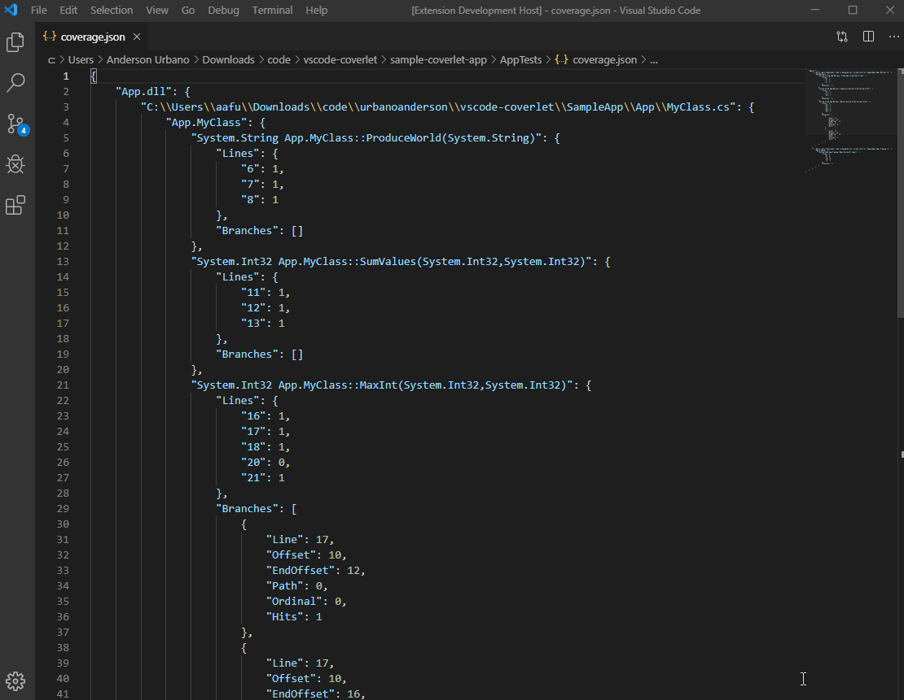

   

# Vscode-Coverlet

## About

Extension for handling [Coverlet](https://github.com/tonerdo/coverlet) reports on .NET projects. It edits report files to strip irrelevant code so you can focus on what needs to be tested.

## Preview

## Usage

- Open command menu on vscode with `CTRL`+`SHIFT`+`P` and run one of the following commands:

	- Run `Coverlet Strip` on an opened `coverlet.json` report file to strip it from everything that is already tested.

	- Run `Coverlet Filecheck` on an opened C# class file to show the existing report contents regarding the file. Alternatively, you can right-click the file on vscode explorer and run the filecheck command. The result will show both tested and untested lines for the file.

## Debugging the extension source

- Clone the source at `https://github.com/urbanoanderson/vscode-coverlet.git`

- Open extension folder on vscode

- Run `npm install` on terminal

- Click on `Start Debugging` in the Debug panel

- A test instance of vscode loaded with the extension will appear

- Extra: you can also run unit tests for the extension by executing `npm test` on terminal

## Release Notes

### 1.1.1

- Fixed subfolder issue on Filecheck command
- Added more errorchecks and messages

### 1.1.0

- Added Filecheck command

### 1.0.1

- Fixed bug that leaved null values while removing some branches

### 1.0.0

- Initial Version

## Acknowledgements

Icon made by Freepik and available at [Flaticon](www.flaticon.com/free-icon/test_115050)